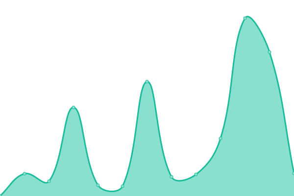

# [📈 Live Status](https://Yosuamuliawan19.github.io/upptime): <!--live status--> **🟥 Complete outage**

This repository contains the open-source uptime monitor and status page for [Yosua Muliawan](https://yosua.io), powered by [Upptime](https://github.com/upptime/upptime).

With [Upptime](https://upptime.js.org), you can get your own unlimited and free uptime monitor and status page, powered entirely by a GitHub repository. We use [Issues](https://github.com/Yosuamuliawan19/upptime/issues) as incident reports, [Actions](https://github.com/Yosuamuliawan19/upptime/actions) as uptime monitors, and [Pages](https://Yosuamuliawan19.github.io/upptime) for the status page.

<!--start: status pages-->
<!-- This summary is generated by Upptime (https://github.com/upptime/upptime) -->
<!-- Do not edit this manually, your changes will be overwritten -->
<!-- prettier-ignore -->
| URL | Status | History | Response Time | Uptime |
| --- | ------ | ------- | ------------- | ------ |
|  [yosua.io](https://yosua.io) | 🟥 Down | [yosua-io.yml](https://github.com/Yosuamuliawan19/upptime/commits/HEAD/history/yosua-io.yml) | 

 878ms
     
 | 

<a href="https://status.yosua.io/history/yosua-io">100.00%</a>
    

|  [https://v2.backend.yosua.io/node/portfolio/projects](https://v2.backend.yosua.io/node/portfolio/projects) | 🟥 Down | [https-v2-backend-yosua-io-node-portfolio-projects.yml](https://github.com/Yosuamuliawan19/upptime/commits/HEAD/history/https-v2-backend-yosua-io-node-portfolio-projects.yml) | 

 340ms
     
 | 

<a href="https://status.yosua.io/history/https-v2-backend-yosua-io-node-portfolio-projects">99.88%</a>
    

<!--end: status pages-->

[**Visit our status website →**](https://Yosuamuliawan19.github.io/upptime)

## 📄 License

- Powered by: [Upptime](https://github.com/upptime/upptime)
- Code: [MIT](./LICENSE) © [Yosua Muliawan](https://yosua.io)
- Data in the `./history` directory: [Open Database License](https://opendatacommons.org/licenses/odbl/1-0/)
